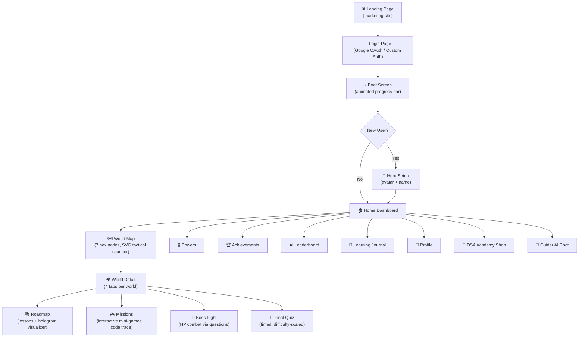
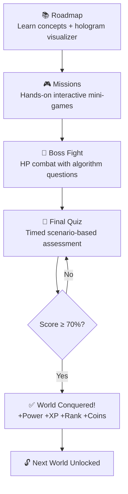

# 🎮 DSA LEGENDS — Complete Project Explanation (Every Point)

> **Live URL:** [https://dsa-legends.vercel.app/](https://dsa-legends.vercel.app/)
> **Project Root:** [DSA-Learning-Game-main](file:///c:/Users/donth_/OneDrive/Desktop/projects/DSA%20Project/DSA-Learning-Game-main/DSA-Learning-Game-main)

---

## 1. 🏗️ Project Overview — What Is This?

**DSA Legends — World of Algorithms** is a **cyber-fantasy RPG game that teaches Data Structures & Algorithms (DSA) through interactive gameplay** — not through lectures, textbooks, or PDFs. It gamifies the entire DSA learning journey by casting the user as a hero who must conquer **7 themed worlds**, each teaching a different data structure or algorithm concept.

The tagline is **"Interview Training Arcade"** — it turns DSA interview preparation into a fun, rewarding game experience with XP, coins, boss fights, quizzes, achievements, and a rank progression system.

**Two deliverables:**
1. **`index.html`** — the fully playable game (~266KB, runs instantly in any browser)
2. **`src/dsa-java/`** — clean, compilable Java reference implementations of every algorithm

---

## 2. 📁 Project File Structure

```
DSA-Learning-Game-main/
├── index.html              ← The ENTIRE game (266 KB, ~5,256 lines, single-file SPA)
├── README.md               ← Project documentation (149 lines)
├── vercel.json             ← Vercel static deployment configuration
├── .gitignore              ← Git ignore rules
├── assets/                 ← 7 world background images (PNG, ~1 MB each)
│   ├── world_1.png         ← Array Kingdom background
│   ├── world_2.png         ← Linked List Forest
│   ├── world_3.png         ← Stack Volcano
│   ├── world_4.png         ← Queue City
│   ├── world_5.png         ← Tree Kingdom
│   ├── world_6.png         ← Graph Galaxy
│   └── world_7.png         ← World War Arena
└── src/dsa-java/           ← Java reference implementations (7 files, ~376 lines total)
    ├── ArrayKingdom.java   ← World 1: arrays, searching, sorting
    ├── LinkedListForest.java ← World 2: singly linked list
    ├── StackVolcano.java   ← World 3: stack + postfix evaluation
    ├── QueueCity.java      ← World 4: circular queue + priority queue
    ├── TreeKingdom.java    ← World 5: BST + heap
    ├── GraphGalaxy.java    ← World 6: graph + BFS/DFS/Dijkstra
    └── Main.java           ← Runnable demo of all worlds
```

---

## 3. 🌐 The Single-File Game — [index.html](file:///c:/Users/donth_/OneDrive/Desktop/projects/DSA%20Project/DSA-Learning-Game-main/DSA-Learning-Game-main/index.html)

This is the **heart of the project** — a massive (~266 KB / 5,256 lines) self-contained HTML file that includes ALL HTML, CSS (~1,256 lines), and JavaScript (~3,960 lines) in one file. It runs instantly in any browser with **zero build tools, zero external JS dependencies** (except Google Identity Services for OAuth), and no server required.

---

### 3.1 HTML Structure & Screen Architecture

The HTML body uses a **single-page application (SPA)** pattern with show/hide panels:

```
<body>
  <canvas id="bg">          ← Full-viewport particle background
  <div id="landing">        ← Marketing/landing page
  <div id="loginpage">      ← Authentication page (Google + custom)
  <div id="app">            ← Main game container
    <div id="hud">          ← Top HUD bar (avatar, XP, coins, level, nav)
    <div id="stage">        ← Screen router target (screens swapped in/out)
  <div id="toasts">         ← Toast notification container (fixed, top-right)
  <div id="overlay">        ← Modal overlay system
  <div id="oracle-bubble">  ← Floating AI chatbot bubble
  <div id="oracle-chat-window"> ← AI chatbot side-panel
</body>
```

**Complete Screen Flow:**



**All navigable screens:**

| Screen | Function | Render Function |
|--------|----------|-----------------|
| Landing | Marketing page with features, stats, CTA | Static HTML |
| Login | Google OAuth + custom username/password | Static HTML |
| Boot | Animated "system booting" progress bar | JS animation |
| Hero Setup | Avatar picker (8 emojis) + name input | `renderSetup()` |
| Home Dashboard | XP ring, stats tiles, nav grid, Guider AI card | `renderHome()` |
| World Map | SVG tactical map with 7 hex nodes | `renderMap()` |
| World Detail | Per-world: Roadmap / Missions / Boss / Quiz tabs | `renderWorld(id)` |
| Mission | Interactive mini-game per mission | Various game functions |
| Boss Fight | Timed HP combat with algorithm questions | `startBoss(id)` |
| Quiz | Timed scenario-based assessment | `startQuiz(id)` |
| Achievements | Full achievement gallery (~23 achievements) | `renderAchv()` |
| Leaderboard | Speed-based rankings with bot entries | `renderLeaderboard()` |
| Powers | 6 special abilities (one per world) | `renderPowers()` |
| Profile | Player stats + account info + reset/logout | `renderProfile()` |
| Shop | 7 purchasable DSA reference books | `renderShop()` |
| Journal | Collapsible per-world lesson review | `renderJournal()` |
| Guider AI | Keyword-matched DSA Q&A with chat history | `renderGuiderChat()` |

---

### 3.2 CSS Design System (~1,256 lines)

#### Custom Properties (Design Tokens)
```css
--void: #05060d;         /* Deepest background */
--void2: #0a0d1c;        /* Secondary background */
--panel: rgba(18,22,46,.55);  /* Glass panel fill */
--blue: #2dd4ff;         /* Primary - Neon cyan */
--purple: #b14dff;       /* Secondary - Electric purple */
--green: #39ff9e;        /* Accent - Cyber green */
--pink: #ff4d9d;         /* Danger/hot */
--gold: #ffd166;         /* XP, coins, rewards */
--txt: #e8ecff;          /* Primary text */
--dim: #8a93c4;          /* Muted text */
--glow-b / --glow-p / --glow-g  /* Glow box-shadows */
```

#### Typography (Google Fonts)
| Font | Use |
|------|-----|
| **Orbitron** | Display/headings (sci-fi, geometric) |
| **Rajdhani** | Body text |
| **JetBrains Mono** | Code/monospace display |
| **Cinzel / Cinzel Decorative** | Loaded, used sparingly |

#### Key CSS Techniques
- **Glassmorphism**: `.glass` class → `backdrop-filter: blur(14px)`, semi-transparent backgrounds, subtle 1px borders
- **Gradient Text**: `background-clip: text; color: transparent` for shimmering title effects
- **Hexagonal Clip-Paths**: `.orb` and `.hex-border` use `clip-path: polygon(...)` for world map hex nodes
- **Custom Scrollbar**: Webkit-styled to match the dark theme
- **Landing Page Override**: Login/landing pages use a monochromatic black/white theme (overriding the colorful game palette)
- **Hologram Grid**: Overlays with scanline animations for the visualizer

#### Animations (20+ `@keyframes`)

| Animation | Effect |
|-----------|--------|
| `flick` | Title text flicker |
| `bob` | Floating bobbing motion |
| `shake` | Screen shake on wrong answer |
| `spinSlow` / `spinSlowRev` | World map node ring rotations |
| `dashMove` | Animated path connection dashes |
| `hologramScan` | Scanline sweep effect |
| `pulseGlow` / `holoPulse` | Pulsing glow effects |
| `comboPop` | Combo counter pop animation |
| `streakFlash` | Streak message flash |
| `cellWin` / `cellFail` | Array cell success/failure feedback |
| `timerPulse` | Danger timer pulsing red |
| `bonusFly` | Floating bonus point text rising up |
| `screenShake` | Full-screen shake effect |
| `orbFloat` | Landing page floating orbs |
| `scrollBounce` | Scroll indicator bounce |
| `ctaGlow` | CTA button glow pulse |
| `landPulse` / `simpleTitleGlow` | Landing page ambient effects |
| `telemetryPulse` | HUD telemetry bar animation |
| `dropInNew` | Array element insertion drop-in |

#### Responsive Breakpoints

| Breakpoint | Changes |
|------------|---------|
| `≤ 860px` | Home grid → single column, nav grid → 2-column, HUD wraps, XP bar on own row |
| `≤ 600px` | Landing features → 2-column, login card padding reduced |
| `≤ 420px` | Landing features → single column |
| `≥ 900px` | Arena split uses CSS Grid (1.4fr 1fr) side-by-side layout |

---

### 3.3 JavaScript Game Engine (~3,960 lines)

#### 3.3.1 State Management

Global state object `S`:
```javascript
S = {
  name: "",           // Player name
  avatar: "",         // Emoji avatar
  level: 1,           // Current level
  xp: 0,              // Total XP
  coins: 0,           // Currency
  worlds: {},         // Per-world progress { road, miss, boss, quiz, clear }
  achv: {},           // Achievement unlock status
  powers: {},         // Unlocked powers { w1: true, w2: false, ... }
  inv: [],            // Inventory items
  stats: {},          // Aggregate stats
  chatHistory: [],    // Guider AI conversation history
  answeredQuestions: {} // Prevents question repetition
}
```

#### 3.3.2 Screen Router
- **`CURRENT`** — tracks active screen ID
- **`screen(id, html)`** — renders HTML into `#stage` with CSS transitions (opacity + translateY)
- **`go(where, arg)`** — central navigation dispatcher:
  - Clears active timers
  - Calls the appropriate render function
  - Refreshes HUD
  - Toggles chatbot visibility

#### 3.3.3 Rendering Approach
- Template-literal functions generate HTML strings
- Direct `innerHTML` injection (no virtual DOM, no framework)
- `requestAnimationFrame` for transition activation
- Event listeners attached via `onclick` attributes in HTML strings

---

### 3.4 Game Mechanics — Detailed

#### XP & Leveling System
| Action | XP Reward |
|--------|-----------|
| Roadmap Lesson | +15 XP |
| Mission (base) | +60–120 XP |
| Mission (combo bonus) | up to +50 XP |
| Boss Defeat | +150 XP |
| Quiz Pass | +120 XP |
| Quiz Fail | +40 XP (consolation) |
| World Clear | +100 XP |
| Achievement Unlock | +25 coins |

**Level formula:** `xpForLevel(level) = level × 120` XP needed per level (infinite scaling)

#### Coin Economy
- Earned alongside XP from all activities
- Spent in the **DSA Academy Shop** to purchase reference books
- Displayed in HUD at all times

#### Rank Progression (7 tiers)
| Rank | Requirement |
|------|-------------|
| 🟢 **Beginner** | Start |
| 🔵 **Explorer** | Complete World 1 |
| 🟣 **Warrior** | Complete World 2 |
| 🟠 **Champion** | Complete World 3 |
| 🔴 **Master** | Complete World 4 |
| ⭐ **Legend** | Complete World 5 |
| 👑 **DSA Legend** | Complete World 6+ |

#### Combo & Streak System
- `_combo` counter increments on correct answers, resets on wrong
- **Combo bonuses:** up to +50 XP, +25 coins
- **Time bonus:** `max(0, 30 - elapsed) × 2` extra XP
- **Streak messages:**
  - 5× → "ON FIRE! 🔥"
  - 10× → "UNSTOPPABLE! ⚡"
  - 15× → "GODLIKE! 👑"

#### Powers System (6 abilities, one per world)
| Power | World | Effect |
|-------|-------|--------|
| 🔍 Index Vision | W1 | Reveals one correct answer |
| ➡️ Pointer Vision | W2 | Removes two wrong options |
| ↩️ Undo Move | W3 | Take back one wrong answer |
| ⏸️ Time Freeze | W4 | Pauses timer for 10 seconds |
| 🌿 Traversal Hint | W5 | Highlights next correct step |
| 🧭 Path Finder | W6 | Auto-solves one boss question |

#### Achievement System (~23 achievements)
- **Categories:** First steps, mission-specific (indexing, traversal, insertion, deletion, linear search, binary search, sorting), roadmap, boss, quiz, world clear, meta
- **Meta achievements:** Rich (coin milestone), Level 5, Level 10, Flawless (100% quiz), Power Up, Legend
- **Toast notifications** with animated popup on unlock
- Tracked persistently in state

---

## 4. 🗺️ The Seven Worlds — Complete Breakdown

### World 1: 💎 Array Kingdom (Crystal Desert Kingdom)
- **Color:** Cyan | **Boss:** 🐉 Array Dragon
- **Teaches:** Indexing, traversal, insert, delete, linear search, binary search, 4 sorting algorithms
- **7 Interactive Missions (fully built):**

| # | Mission | Mechanic | What It Teaches |
|---|---------|----------|-----------------|
| 1 | **Crystal Collection** | Click correct array index | O(1) random access |
| 2 | **Traversal Adventure** | Visit cells 0→n-1 in order | Sequential traversal |
| 3 | **Treasure Insertion** | Click correct slot, watch animated shift | Array insert + element shifting |
| 4 | **Corrupted Removal** | Click corrupted cell, watch animated shift | Array delete + element shifting |
| 5 | **Search Dungeon** | Scan left→right through array | Linear search O(n) |
| 6 | **Binary Search Temple** | Halve sorted range visually | Binary search O(log n) |
| 7 | **Sorting Arena** | Choose algorithm, step through visualization | Bubble / Selection / Merge / Insertion sort |

---

### World 2: 🌲 Linked List Forest (Whispering Node Woods)
- **Color:** Green | **Boss:** 👹 Cycle Monster
- **Teaches:** Nodes, pointers, traversal, insert/delete, reverse, cycle detection
- **2 Missions:**

| # | Mission | Mechanic |
|---|---------|----------|
| 1 | **Wire the Nodes** | Connect nodes via pointers (concept challenge) |
| 2 | **Cycle Hunt** | Spot the cycle in a linked list |

---

### World 3: 🌋 Stack Volcano (Molten LIFO Peaks)
- **Color:** Pink | **Boss:** 👺 Expression Titan
- **Teaches:** Push/pop/peek, overflow/underflow, postfix expression evaluation
- **2 Missions:**

| # | Mission | Mechanic |
|---|---------|----------|
| 1 | **Falling Stones** | Interactive push/pop stack simulation |
| 2 | **Postfix Forge** | Evaluate postfix expressions step-by-step |

---

### World 4: 🏙️ Queue City (Neon FIFO Metropolis)
- **Color:** Purple | **Boss:** 🤖 Scheduling Robot
- **Teaches:** FIFO principle, enqueue/dequeue, circular queue, priority queue
- **2 Missions:**

| # | Mission | Mechanic |
|---|---------|----------|
| 1 | **Traffic Control** | Click front car to dequeue (FIFO simulation) |
| 2 | **Priority Dispatch** | Priority queue ordering challenge |

---

### World 5: 🌳 Tree Kingdom (Sacred Binary Grove)
- **Color:** Gold | **Boss:** 🧌 Tree Guardian
- **Teaches:** Binary tree, BST, traversals (inorder/preorder/postorder), AVL, heaps
- **2 Missions:**

| # | Mission | Mechanic |
|---|---------|----------|
| 1 | **Grow the BST** | Interactive BST insertion visualization |
| 2 | **Inorder Walk** | BST traversal exercise |

---

### World 6: 🌌 Graph Galaxy (Edge-Light Nebula)
- **Color:** Indigo | **Boss:** 👾 Graph Overlord
- **Teaches:** Nodes/edges, BFS, DFS, shortest path, Dijkstra's algorithm
- **2 Missions:**

| # | Mission | Mechanic |
|---|---------|----------|
| 1 | **BFS Wave** | BFS traversal challenge |
| 2 | **DFS Dive** | DFS traversal challenge |

---

### World 7: ⚔️ World War Arena (The Final Convergence)
- **Color:** Red | **Boss:** 👑 Algorithm Emperor
- **No missions** — directly accesses Boss Fight + Legendary Quiz
- **Requires all 6 previous worlds completed**
- **Question bank pulls from ALL worlds combined** (shuffled)
- Beating this grants the **🏆 DSA Legend** title

---

## 5. 🎯 Core Game Loop



All four sections (Roadmap → Missions → Boss → Quiz) must be completed to conquer a world.

---

## 6. ⚔️ Boss Fight System

- **HP Bars:** Boss = 100HP, Player = 100HP
- **Combat is question-driven:** Algorithm questions from `getUnrepeatedQuestions()` (filtered to avoid repeats)
- **Correct answer:** Deals `25 + min(combo × 3, 15)` damage to boss + combo streak messages
- **Wrong answer:** Player takes **20 damage** + screen shake animation
- **Win condition:** Boss HP ≤ 0 → rewards (+150 XP, +80 coins), unlocks quiz tab
- **Lose condition:** Player HP ≤ 0 → retry or retreat option
- **Visuals:** Boss avatar with shake animation on hit, HP bars with gradient fills, damage numbers
- **Rewards:** First win unlocks achievement; subsequent wins are "rematches"

---

## 7. 🧠 Quiz System

| Aspect | Detail |
|--------|--------|
| **Questions per quiz** | 5, drawn from `questionBank(id)` with repeat-avoidance |
| **Difficulty tiers** | Easy (30s/q), Medium (40s/q), Hard (50s/q), Expert (60s/q) |
| **Dual timers** | Per-question (90s max) + overall countdown (e.g., 150s for World 1) |
| **Timer visualization** | Progress bar + countdown text; color shifts (blue → gold → pink) as time runs low |
| **Pass threshold** | **70%** required to conquer the world |
| **Scoring** | Tracks best score, total quiz time, quizzes cleared |
| **Time expiry** | Auto-finishes quiz with "TIME'S UP" message |
| **Pass rewards** | +120 XP, +60 coins, world completion |
| **Fail rewards** | +40 XP, +15 coins (consolation) |
| **100% score** | Unlocks "Flawless" achievement |

### Question Bank
- ~9 questions per world, **dynamically generated with randomized values** each attempt
- Covers: memory addresses, complexity analysis, operation behavior, data structure comparisons
- World 7 merges ALL question banks and shuffles

---

## 8. 🗺️ World Map Implementation

**SVG-based tactical map** ("TACTICAL SCANNER v2.0"):

- **7 hexagonal nodes** positioned at hardcoded percentage coordinates: `[[18,80], [34,52], [50,78], [66,46], [80,72], [88,38], [50,18]]`
- **Hex node design:** `clip-path: polygon(...)` hexagons with color-coded borders, spinning dashed/dotted ring animations
- **Connection paths:** SVG lines between adjacent nodes with animated dashes; cleared paths get colored with animated traveling circles
- **Radar sweep:** SVG animated rotating line from center with concentric circles
- **Corner HUD marks:** Decorative bracket borders

**Interactive HUD panel on hover:**
- Shows live mouse coordinates as X/Y percentages
- On node hover: displays world name, theme, guardian, threat level (complexity class), and access status (CLEARED / ACTIVE / LOCKED)
- Telemetry bars animate on hover

**Locking logic:**
- World 1: unlocked by default
- Worlds 2-6: unlock when previous world is cleared
- World 7: requires ALL 6 previous worlds completed
- **Visual states:** `.done` (green glow), active (blue glow), `.locked` (grayscale, dimmed, no click)

---

## 9. 🔬 Hologram Visualizer Engine

Each world has **animated holographic visualizations** that display during the Roadmap phase:

| World | Visualization |
|-------|--------------|
| W1: Array | Array operations: access (index highlight), insert (shift animation), delete (shift animation) |
| W2: Linked List | Node traversal, pointer insertion, Floyd's cycle detection |
| W3: Stack | Push/pop/peek cycle animation |
| W4: Queue | Enqueue/dequeue cycle animation |
| W5: Tree | BST structure display, search path highlighting, inorder traversal |
| W6: Graph | Graph structure, BFS wave propagation, Dijkstra's weighted path |
| W7: Sorting | Animated bar chart sorting |

**Code Trace Visualizer:**
- During missions, shows syntax-highlighted pseudocode
- Active line highlighting with green left-border, glow, and translateX shift
- Syntax colors: keywords (cyan), strings (green), numbers (gold), builtins (purple), comments (dim)

---

## 10. 🤖 Guider AI Chatbot

> [!NOTE]
> This is **NOT connected to any LLM/API** — it's a fully client-side keyword-matching system.

**How it works:**
1. User types a DSA question
2. Query is lowercased, special chars stripped
3. System checks against 14 DSA topic entries for keyword matches
4. Best-scoring match is rendered with:
   - **Analogy** (real-world comparison)
   - **Simplified concept explanation**
   - **Complexity matrix** (time/space)
   - **Code scroll** (syntax-highlighted example)

**14 Topics covered:** Dijkstra, AVL, Big O, Array, Linked List, Stack, Queue, Tree, Graph, Sorting, Hash Table, Heap, Binary Search, Recursion/DP/Greedy

**Non-DSA queries** get: `"ACCESS DENIED: NON-DSA ANOMALY"`

**Chat history** is persisted in `S.chatHistory[]` with new/delete/select functionality.

---

## 11. 🛒 DSA Academy Shop

**7 purchasable reference books** — deep educational content beyond the game:

| Book | Content |
|------|---------|
| 📕 Array Grimoire | Row/Column-Major arrays, amortized doubling |
| 📗 Linked List Codex | Floyd's math proof, pointer techniques |
| 📘 Stack Spellbook | Shunting-Yard algorithm, call stack, TCO |
| 📙 Queue Scroll | Circular queues, priority queue internals |
| 📔 Tree Tome | Heap mappings, AVL rotations, Red-Black trees |
| 📓 Graph Grimoire | Dijkstra/Bellman-Ford/Floyd-Warshall comparison, MSTs |
| 📒 Emperor's Manual | Algorithmic patterns: Two Pointers, Sliding Window, Fast/Slow |

- Multi-page modal reader with paginated content
- Purchased with in-game coins

---

## 12. 🔐 Authentication System

### Google Sign-In (OAuth)
- Uses **Google Identity Services** (`accounts.google.com/gsi/client`)
- JWT decoded client-side (base64 payload extraction, no server)
- Renders native Google sign-in button
- Initialization with polling fallback (up to 20 attempts × 200ms)

### Custom Auth
- Username/password stored in localStorage (plaintext — educational project, no server)
- Validation: min 3 char name (alphanumeric), min 4 char password

### Multi-Account Support
Three localStorage keys:
| Key | Purpose |
|-----|---------|
| `dsa_legends_save` | Current active game state (JSON) |
| `dsa_legends_accounts` | Multi-account registry `{key: {username, password/email, avatar, saveData}}` |
| `dsa_legends_auth` | Current authenticated user info |

---

## 13. 💾 Save/Load System (localStorage)

- **Auto-saves** after every significant action (mission clear, boss defeat, quiz pass, XP gain, achievement unlock, etc.)
- `save()` writes to both `dsa_legends_save` AND the corresponding account entry in `dsa_legends_accounts`
- On startup: checks `dsa_legends_auth` → loads account-specific save → falls back to `dsa_legends_save` → falls back to `freshState()`
- **Continue Journey** — loads saved state and resumes
- **Reset** — clears state, saves fresh state, reloads page (with confirmation dialog)
- **Fully offline-capable** — no server needed

---

## 14. ✨ Particle Effects & Visual Polish

### Background Particle System
- Full-viewport `<canvas>` with **90 particles**
- 3 cycling colors (cyan, purple, green)
- Random radii (0.4–2.4px), velocities, opacities
- Shadow blur glow on each particle
- `requestAnimationFrame` animation loop
- Responds to window resize

### Landing Page Canvas
- Separate canvas with **30 floating graph-network nodes**
- Monochromatic gray, slow drift (0.4 velocity)
- Connection lines drawn between nodes within 130px distance
- Pure black background

### In-Game Effects
- **Combo counter:** Positioned absolute, fire/ultra CSS classes with glow
- **Streak messages:** Centered, gradient text, scale+fade animation
- **Screen shake:** CSS animation on wrong answers
- **Cell animations:** Win (scale bounce + rotate), Fail (horizontal shake)
- **Bonus popups:** Float upward and fade out
- **Boss hit flash:** Shake animation on boss avatar
- **Timer danger mode:** Pulsing red with animation

---

## 15. ☕ Java Reference Implementations — [src/dsa-java/](file:///c:/Users/donth_/OneDrive/Desktop/projects/DSA%20Project/DSA-Learning-Game-main/DSA-Learning-Game-main/src/dsa-java)

These are **clean, compilable Java source files** (package `dsa`, ~376 lines total) implementing every algorithm the game teaches.

---

### [ArrayKingdom.java](file:///c:/Users/donth_/OneDrive/Desktop/projects/DSA%20Project/DSA-Learning-Game-main/DSA-Learning-Game-main/src/dsa-java/ArrayKingdom.java) — World 1 (90 lines)
**Data Structure:** Primitive `int[]` arrays (all static methods)

| Method | Algorithm | Time |
|--------|-----------|------|
| `traverse(int[] a)` | Linear traversal, prints each element | O(n) |
| `insert(int[] a, int pos, int val)` | Insertion at index by shifting right into new array | O(n) |
| `delete(int[] a, int pos)` | Deletion at index by shifting left into new array | O(n) |
| `linearSearch(int[] a, int target)` | Sequential scan | O(n) |
| `binarySearch(int[] a, int target)` | Iterative binary search (sorted input required) | O(log n) |
| `bubbleSort(int[] a)` | Adjacent element swaps | O(n²) |
| `selectionSort(int[] a)` | Find minimum, swap | O(n²) |
| `quickSort(int[] a, int lo, int hi)` | Recursive with Lomuto partition (pivot = last) | O(n log n) avg |
| `mergeSort(int[] a, int l, int r)` | Recursive with temp array + System.arraycopy | O(n log n) |

---

### [LinkedListForest.java](file:///c:/Users/donth_/OneDrive/Desktop/projects/DSA%20Project/DSA-Learning-Game-main/DSA-Learning-Game-main/src/dsa-java/LinkedListForest.java) — World 2 (53 lines)
**Data Structure:** Singly linked list (inner class `Node` with `int val`, `Node next`)

| Method | Algorithm | Time |
|--------|-----------|------|
| `insertFront(int v)` | Prepend new node as head | O(1) |
| `insertEnd(int v)` | Traverse to tail, append | O(n) |
| `delete(int v)` | Find by value, bypass pointer | O(n) |
| `reverse()` | In-place reversal with 3 pointers (prev, cur, next) | O(n) |
| `hasCycle(Node head)` | **Floyd's Tortoise & Hare** cycle detection (static) | O(n) time, O(1) space |

---

### [StackVolcano.java](file:///c:/Users/donth_/OneDrive/Desktop/projects/DSA%20Project/DSA-Learning-Game-main/DSA-Learning-Game-main/src/dsa-java/StackVolcano.java) — World 3 (43 lines)
**Data Structure:** Array-based stack with fixed capacity (`int[] data`, `int top`)

| Method | Algorithm | Time |
|--------|-----------|------|
| `push(int v)` | Push with overflow guard (throws RuntimeException) | O(1) |
| `pop()` | Pop with underflow guard | O(1) |
| `peek()` | View top without removal | O(1) |
| `isEmpty()` / `isFull()` | Status checks | O(1) |
| `evalPostfix(String expr)` | **Postfix expression evaluation** using ArrayDeque; handles +, −, ×, ÷ (static) | O(n) |

---

### [QueueCity.java](file:///c:/Users/donth_/OneDrive/Desktop/projects/DSA%20Project/DSA-Learning-Game-main/DSA-Learning-Game-main/src/dsa-java/QueueCity.java) — World 4 (34 lines)
**Data Structure:** Circular array-based queue (inner class `CircularQueue`)

| Method | Algorithm | Time |
|--------|-----------|------|
| `enqueue(int v)` | Insert at `(front + size) % length`; returns false if full | O(1) |
| `dequeue()` | Remove from `front`, advance with modulo wrap | O(1) |
| `peek()` | View front element | O(1) |
| `priorityDemo()` | **Priority Queue** demo using Java's `PriorityQueue` (min-heap) with `int[]` pairs `[priority, job]` | O(n log n) |

---

### [TreeKingdom.java](file:///c:/Users/donth_/OneDrive/Desktop/projects/DSA%20Project/DSA-Learning-Game-main/DSA-Learning-Game-main/src/dsa-java/TreeKingdom.java) — World 5 (43 lines)
**Data Structure:** Binary Search Tree (inner class `Node` with `int val`, `Node left`, `Node right`)

| Method | Algorithm | Time |
|--------|-----------|------|
| `insert(int v)` | Recursive BST insertion (left if <, right if ≥) | O(h) |
| `search(int v)` | Iterative BST search | O(h) |
| `inorder(Node n)` | Left → Root → Right (produces sorted output) | O(n) |
| `preorder(Node n)` | Root → Left → Right | O(n) |
| `postorder(Node n)` | Left → Right → Root | O(n) |
| `heapDemo()` | **Min-heap** demo using Java's PriorityQueue (static) | O(n log n) |

---

### [GraphGalaxy.java](file:///c:/Users/donth_/OneDrive/Desktop/projects/DSA%20Project/DSA-Learning-Game-main/DSA-Learning-Game-main/src/dsa-java/GraphGalaxy.java) — World 6 (60 lines)
**Data Structure:** Weighted undirected graph via adjacency list (`Map<Integer, List<int[]>>`)

| Method | Algorithm | Time |
|--------|-----------|------|
| `addEdge(int u, int v, int w)` | Add bidirectional weighted edge | O(1) |
| `bfs(int start)` | **Breadth-First Search** using LinkedList as queue + HashSet visited | O(V + E) |
| `dfs(int start)` | **Depth-First Search** (recursive with visited set) | O(V + E) |
| `dijkstra(int src)` | **Dijkstra's shortest path** using PriorityQueue (min-heap by distance) | O((V+E) log V) |

---

### [Main.java](file:///c:/Users/donth_/OneDrive/Desktop/projects/DSA%20Project/DSA-Learning-Game-main/DSA-Learning-Game-main/src/dsa-java/Main.java) — Entry Point (53 lines)
**Demos all 6 worlds in sequence:**
1. **World 1:** Creates `{5,2,9,1,7,3}`, demos traverse, insert@2, delete@2, linearSearch(7), quickSort, binarySearch(7)
2. **World 2:** Inserts 1-4, prints, reverses, prints again
3. **World 3:** Evaluates postfix `"5 3 + 2 *"` → 16
4. **World 4:** Runs priority queue demo
5. **World 5:** Inserts `{8,3,10,1,6,14}` into BST, inorder print (sorted), heap demo
6. **World 6:** Builds 4-node weighted graph, runs BFS, DFS, Dijkstra from node 0
7. **World 7:** Prints congratulatory message

**How to run:**
```bash
cd src/dsa-java
mkdir -p ../build/dsa
javac -d ../build *.java    # Compile all
cd ../build
java dsa.Main               # Run full demo
```
Requires **JDK 9+** (uses `List.of`, lambdas, generics).

---

## 16. 🚀 Deployment — [vercel.json](file:///c:/Users/donth_/OneDrive/Desktop/projects/DSA%20Project/DSA-Learning-Game-main/DSA-Learning-Game-main/vercel.json)

```json
{
  "version": 2,
  "name": "dsa-legends",
  "builds": [{ "src": "index.html", "use": "@vercel/static" }],
  "routes": [{ "src": "/(.*)", "dest": "/$1" }]
}
```

- **`@vercel/static`** — no build step, serves files as-is
- Catch-all route for clean URL handling
- Deployed to `https://dsa-legends.vercel.app/`
- Zero build time, instant deploys

---

## 17. ♿ Accessibility

**Present:**
- `prefers-reduced-motion: reduce` — disables ALL animations with `!important`
- `title` attributes on HUD buttons
- Semantic `<meta>` description tag
- `lang="en"` on `<html>`

**Absent / Limited:**
- No ARIA roles, labels, or live regions
- No keyboard navigation for game interactions
- No focus management between screens
- No skip-to-content link
- No alt text on world images
- `user-select: none` on body
- Color-only status indicators (though text labels like "CLEARED"/"LOCKED" help)

---

## 18. 🎖️ Additional Feature Systems

### Leaderboard
- Speed-based rankings with **seeded bot entries** (AI-generated competitors)
- Gives competitive feel in single-player mode

### Inventory & Loot
- Items/loot from missions and bosses stored in `S.inv[]`
- Viewable in Inventory screen

### Learning Journal
- Collapsible per-world lesson review
- Tracks concepts learned across all worlds

### Hero Creation
- **8 emoji avatars:** 🧙🦸🧑‍🚀🤖🐱‍👤🦊🐉🦉
- Name input (max 16 chars, pre-filled from Google auth if available)
- Triggers "First Steps" achievement on creation

### Profile Screen
- Displays: Avatar (90px), name, rank, level, XP, coins, worlds cleared, achievements count, boss wins, best quiz score
- Shows signed-in account info (Google name/email)
- Actions: Reset Legend, Logout

---

## 19. 🔮 Planned Roadmap Features (Designed, Not Yet Built)

| Feature | Description |
|---------|-------------|
| **AI Quiz Generator** | Anthropic API (`/v1/messages`) for dynamic quiz questions |
| **Full-Stack Backend** | Node.js + Express + MongoDB for persistent data |
| **Firebase Auth** | Cloud-based authentication replacing localStorage |
| **Multiplayer Leaderboard** | Friends/World rankings via backend API |
| **100+ Achievements** | Scalable framework (just add rows) |
| **More Mini-Games** | Bespoke interactive games for every World 2–6 topic |
| **React + TypeScript** | Production frontend with Phaser.js for game scenes |

### Planned Production Architecture
```
Frontend:  React + TypeScript · Tailwind · Framer Motion · Phaser.js
Backend:   Node.js · Express · MongoDB · Firebase Auth
Services:  Leaderboard API · Quiz Engine API · AI Question Generator (Anthropic)
```

---

## 20. 🎯 Target Audience

- **CS Students** preparing for DSA courses
- **Job seekers** preparing for coding interviews (FAANG, etc.)
- **Self-learners** who find traditional DSA resources boring
- **Anyone** who learns better through games than textbooks

---

## 21. 🏆 Key Technical Highlights Summary

| Aspect | Detail |
|--------|--------|
| **Architecture** | Single-file SPA — no framework, no build tools |
| **Total Size** | ~266 KB HTML (~5,256 lines of HTML/CSS/JS) |
| **CSS** | ~1,256 lines with custom properties, glassmorphism, 20+ animations |
| **JavaScript** | ~3,960 lines — full game engine, router, state management |
| **External Dependencies** | Only Google Identity Services (optional OAuth) |
| **Persistence** | Multi-account localStorage (fully offline-capable) |
| **Accessibility** | Respects `prefers-reduced-motion` OS setting |
| **Responsiveness** | 4 breakpoints (420px, 600px, 860px, 900px) |
| **Visual Effects** | Dual canvas particle systems, SVG tactical map, hologram visualizer |
| **Game Content** | 7 worlds, 17+ missions, 7 bosses, 7 quizzes, ~63 questions |
| **Java Layer** | 7 files, ~376 lines, all compilable with JDK 9+ |
| **Deployment** | Vercel static hosting (instant, CDN-backed) |
| **Assets** | 7 custom world PNGs (~7 MB total) |

---

> **In Summary:** DSA Legends is a fully self-contained, gamified DSA learning platform built as a single HTML file with a companion Java code layer. It transforms the typically dry experience of learning data structures and algorithms into an engaging RPG adventure with 7 worlds, 17+ interactive missions, boss fights, quizzes, a shop, an AI chatbot, and a complete progression system — all running in the browser with no server or build tools required.
